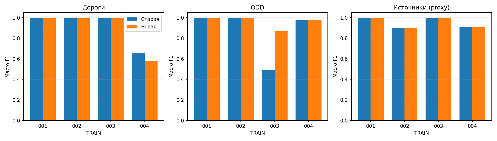
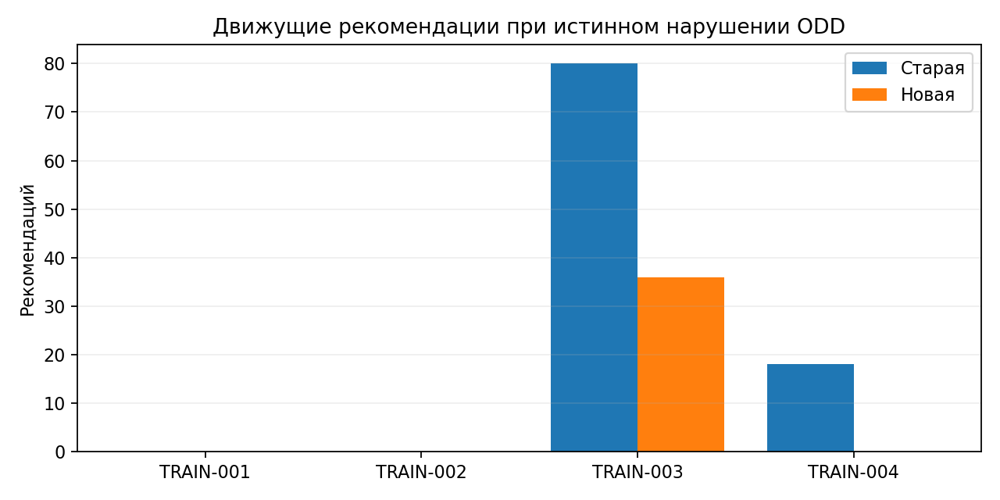
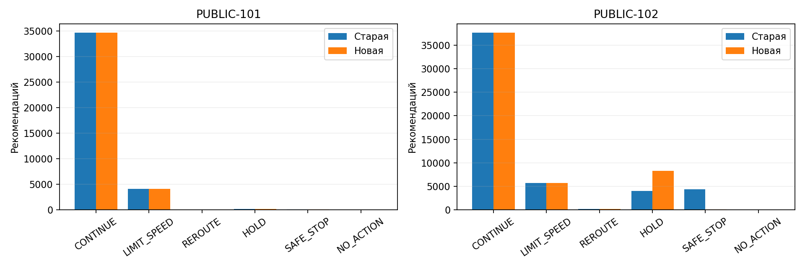
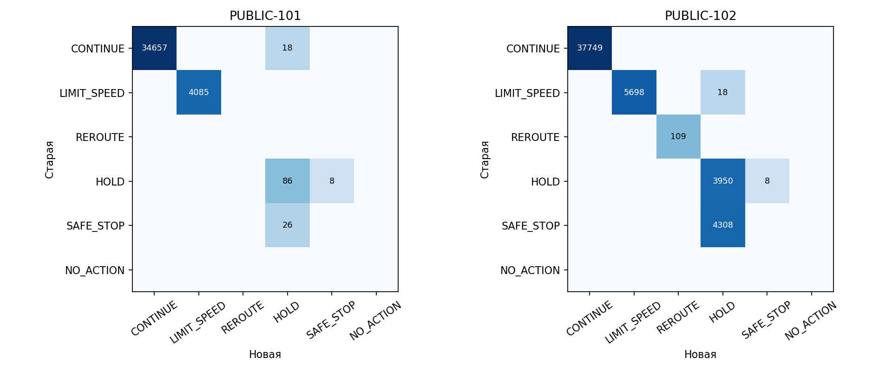

# Сравнение старого и нового алгоритма

Дата: 28.09.2026. Старая версия: ca971a4 (runtime технической сдачи); новая: 6486a44. Восемь предложенных направлений реализованы без изменения правила CONTINUE/REROUTE. ML и обучаемая калибровка не используются.

## Что изменилось

| Направление | Реализация и смысл |
|---|---|
| Доверие по показателям | `corridor/trust.py`, `fusion.py`: отдельные Beta-окна для доступности, скорости, очереди, видимости, дождя и ветра. OPEN не подтверждает скорость. Числовые отказы не выключают автоматически корректную доступность. При отсутствии сопоставимого независимого подтверждения положительный голос не начисляется. |
| Доступность и загрузка | `basic.py`, `fusion.py`: закрытие/полосы отдельно от очереди. Три разных сообщения очереди >=100 м за 60 с либо два источника допускают CONGESTED без использования рекомендованной скорости RSU как измеренной. Прямое подтверждение частичной блокировки сохраняет приоритет. |
| Память погоды | `memory.py`, `odd.py`: предупреждение ограничено 90 с и 5 км; исчезновение старой станции не доказывает восстановление. До трёх новых подтверждений прежних источников — UNKNOWN, а не вымышленное нарушение. |
| Качество V2X | `fusion.py`, `odd.py`: учитывается цикл публикаций по сегментам, явный отказ/потеря >=20%, устойчивые задержки и пропуски обновления. Свежая посылка сама по себе не отменяет явный сбой. |
| Устойчивость | `memory.py`: опасность принимается сразу; восстановление дороги требует трёх новых сигнатур. Дубли не продлевают число подтверждений. Переходная оценка UNKNOWN ограничена 60 с. Это не cooldown маршрутизации. |
| Стоимость маршрута | `limits.py`, `routing.py`: общие caps WET=60, WATER_FILM/PARTIAL=40, очередь/затор/пограничная видимость=30 и надёжная рекомендация RSU. FLOODED исключён; положительное время и штраф неопределённости сохранены. |
| Поддержка | `resources.py`: риск → груз → время до опасного продолжения → прежнее назначение → ID. ETA не перебивает более высокий риск или приоритет груза. Ограничение шести операторов сохранено. |
| Подъезд к площадке | `limits.py`, `resources.py`, `guard.py`: проверяются текущий фрагмент, весь направленный путь и цель, масса/av_allowed/сооружения, COMPLIANT и не FLOODED. UNKNOWN недостаточно. Нет доказанного подъезда — диагностический HOLD и доступная поддержка. |

Дополнительно возраст карты увеличивается на возраст телеметрии. Последовательность цифрового двойника и задержанные/замороженные последовательности не используются как доказательство PACKET_LOSS; явные сообщения о потерях всё ещё дают этот код, поэтому совпадение с единственным эталонным типом сбоя не гарантируется. Восстановление доставки/отключённого показателя после трёх новых своевременных обновлений отделено от положительных Beta-голосов. Справочник площадок задаёт только сегмент, а не точный offset точки остановки: время подъезда остаётся приближением.

## TRAIN: измерения качества

Все четыре TRAIN уже участвовали в анализе ошибок. Это регрессия на известных сценариях, не независимый hold-out и не прогноз приватного балла. Метрика источников — proxy статуса по интервалам отказов, а не полный эталон.

| Сценарий | Дороги F1: старый → новый | ODD F1: старый → новый | Источники proxy F1: старый → новый | Движение вне истинного ODD: старый → новый |
|---|---:|---:|---:|---:|
| TRAIN-001 | 0.9994 → 0.9994 | 0.9993 → 0.9993 | 1.0000 → 1.0000 | 0 → 0 |
| TRAIN-002 | 0.9935 → 0.9935 | 0.9995 → 0.9993 | 0.8965 → 0.8965 | 0 → 0 |
| TRAIN-003 | 0.9956 → 0.9956 | 0.4923 → 0.8673 | 0.9972 → 0.9972 | 80 → 36 |
| TRAIN-004 | 0.6595 → 0.5800 | 0.9811 → 0.9793 | 0.9106 → 0.9106 | 18 → 0 |

Строгие трёхшаговые ODD-эпизоды по опубликованному gate: 0 → 0. Это не проверка всех физических аварий.

| Сценарий | Road MSE: старый → новый | ODD MSE: старый → новый | Переключения motion | Проверки guard: старый → новый |
|---|---:|---:|---:|---:|
| TRAIN-001 | 0.00351 → 0.00351 | 0.12284 → 0.12285 | 132 → 132 | 0 → 0 |
| TRAIN-002 | 0.01511 → 0.01512 | 0.12329 → 0.12331 | 232 → 265 | 0 → 0 |
| TRAIN-003 | 0.00553 → 0.00553 | 0.23681 → 0.24390 | 1687 → 1620 | 0 → 0 |
| TRAIN-004 | 0.02745 → 0.01905 | 0.18684 → 0.18647 | 380 → 396 | 0 → 0 |

### Отдельные коды и задержки обнаружения

| Сценарий | Группа / код | TP: старый → новый | FP | FN |
|---|---|---:|---:|---:|
| TRAIN-002 | source_fault_codes / DELAY | 144 → 144 | 0 → 0 | 6 → 6 |
| TRAIN-002 | source_fault_codes / DRIFT | 0 → 0 | 0 → 0 | 300 → 300 |
| TRAIN-002 | source_fault_codes / FREEZE | 134 → 134 | 0 → 0 | 6 → 6 |
| TRAIN-002 | source_fault_codes / PACKET_LOSS | 0 → 0 | 426 → 426 | 0 → 0 |
| TRAIN-002 | source_fault_codes / STALE | 197 → 197 | 0 → 0 | 17 → 17 |
| TRAIN-002 | odd_codes / MAP_AGE | 0 → 0 | 0 → 18 | 0 → 0 |
| TRAIN-003 | source_fault_codes / BIAS | 0 → 0 | 0 → 0 | 180 → 180 |
| TRAIN-003 | source_fault_codes / DELAY | 180 → 180 | 190 → 190 | 0 → 0 |
| TRAIN-003 | source_fault_codes / PACKET_LOSS | 186 → 186 | 360 → 360 | 0 → 0 |
| TRAIN-003 | odd_codes / MAP_AGE | 0 → 0 | 0 → 18 | 0 → 0 |
| TRAIN-003 | odd_codes / V2X | 0 → 1942 | 0 → 919 | 1942 → 0 |
| TRAIN-003 | odd_codes / VISIBILITY | 0 → 0 | 0 → 0 | 597 → 597 |
| TRAIN-004 | source_fault_codes / BYZANTINE | 0 → 0 | 0 → 0 | 196 → 196 |
| TRAIN-004 | source_fault_codes / OUTAGE | 578 → 578 | 0 → 0 | 0 → 0 |
| TRAIN-004 | source_fault_codes / PACKET_LOSS | 0 → 0 | 580 → 580 | 0 → 0 |
| TRAIN-004 | source_fault_codes / STALE | 139 → 139 | 4 → 4 | 13 → 13 |
| TRAIN-004 | odd_codes / MAP_AGE | 3240 → 3258 | 0 → 0 | 18 → 0 |
| TRAIN-004 | odd_codes / RAIN | 4854 → 4854 | 0 → 0 | 0 → 0 |

Задержки обнаружения и TP/FP/FN каждого кода сохранены в JSON TRAIN. Детальные ошибки ODD/дорог/источников, временные окна и эпизоды: `analysis/train-new/` в архиве аналитики.

## PUBLIC: различия фактических ответов

Labels отсутствуют: различие команд не доказывает улучшение. Старый образ повторно обработал оба сценария; все 1260 JSON-ответов побайтово совпали с файлами ранее сданного архива. Новые ответы получены финальным образом `corridor-solution:final` для архива Кариков Team2.zip; прежний образ сохранён как `corridor-solution:previous`.

| Сценарий | Пакеты | Другая motion_action | Другое назначение поддержки | Другой путь | Другой speed limit | Другая площадка |
|---|---:|---:|---:|---:|---:|---:|
| PUBLIC-101 | 540 | 52 | 16 | 0 | 0 | 34 |
| PUBLIC-102 | 720 | 4334 | 16 | 0 | 18 | 4316 |

| Сценарий | Команда | Старая | Новая | Разница |
|---|---|---:|---:|---:|
| PUBLIC-101 | CONTINUE | 34675 | 34657 | -18 |
| PUBLIC-101 | LIMIT_SPEED | 4085 | 4085 | +0 |
| PUBLIC-101 | REROUTE | 0 | 0 | +0 |
| PUBLIC-101 | HOLD | 94 | 130 | +36 |
| PUBLIC-101 | SAFE_STOP | 26 | 8 | -18 |
| PUBLIC-101 | NO_ACTION | 0 | 0 | +0 |
| PUBLIC-102 | CONTINUE | 37749 | 37749 | +0 |
| PUBLIC-102 | LIMIT_SPEED | 5716 | 5698 | -18 |
| PUBLIC-102 | REROUTE | 109 | 109 | +0 |
| PUBLIC-102 | HOLD | 3958 | 8276 | +4318 |
| PUBLIC-102 | SAFE_STOP | 4308 | 8 | -4300 |
| PUBLIC-102 | NO_ACTION | 0 | 0 | +0 |

Все смены команд с временем, автомобилем, путём, скоростью, площадкой и поддержкой — `PUBLIC-*-action-changes.csv`; все отличия оценок и confidence — `PUBLIC-*-changes.ndjson.gz`.

## Синтетические критические случаи

Проверены 83 сценария, по 48 пакетов, обеими версиями: 3984 + 3984 ответов. Это производные первых 48 пакетов TRAIN-001, а не независимые новые дорожные ситуации. Использованы отдельные справочники случаев массы, вместимости и тоннелей. SHA входов сверены с manifest. Каждый ответ проверен схемой и отдельными проверками топологии/ресурсов/времени.

Проверяются частичные свойства известных мутаций; полный F1/официальный балл вычислить нельзя. Отсутствие ошибки у случая означает только прохождение перечисленных машинных проверок. Пустые/поздние данные, повторения, границы ODD и явные закрытия не приравниваются к физической модели аварий.

| Версия | Случаев с нарушенным проверенным свойством | Случаев с guard-ошибкой | Ответов >2 с в локальном прогоне |
|---|---:|---:|---:|
| Старая | 9 | 0 | 5 |
| Новая | 0 | 0 | 4 |

| Случай | Свойство/ограничение | Старая: нарушения | Новая: нарушения |
|---|---|---|---|
| SYN-011 | ODD-A_map_age_min_below | {"boundary_map_age_min": 28, "moving_at_boundary_violation": 28} | {} |
| SYN-012 | ODD-A_map_age_min_equal | {"boundary_map_age_min": 28, "moving_at_boundary_violation": 28} | {} |
| SYN-025 | ODD-B_map_age_min_below | {"boundary_map_age_min": 28, "moving_at_boundary_violation": 28} | {} |
| SYN-026 | ODD-B_map_age_min_equal | {"boundary_map_age_min": 28, "moving_at_boundary_violation": 28} | {} |
| SYN-040 | ODD-C_map_age_min_below | {"boundary_map_age_min": 28, "moving_at_boundary_violation": 28} | {} |
| SYN-041 | ODD-C_map_age_min_equal | {"boundary_map_age_min": 28, "moving_at_boundary_violation": 28} | {} |
| SYN-055 | ODD-D_map_age_min_below | {"boundary_map_age_min": 28, "moving_at_boundary_violation": 28} | {} |
| SYN-056 | ODD-D_map_age_min_equal | {"boundary_map_age_min": 28, "moving_at_boundary_violation": 28} | {} |
| SYN-061 | blackout_recovery | {"weather_still_excluded_after_3_updates": 56} | {} |

### Риски до появления подтверждающих событий

Отдельно считаются ситуации, когда генератор уже изменил физическое состояние, но соответствующее измерение ещё не доставлено. Они не объявляются нарушением известного алгоритму факта.

| Случай | Риск | Старая | Новая |
|---|---|---:|---:|
| SYN-071 | moving_during_v2x_mutation | 36 | 36 |
| SYN-071 | v2x_mutation_unrecognized | 36 | 36 |
| SYN-073 | mutated_closure_predicted_available | 60 | 60 |
| SYN-073 | stop_on_mutated_closure | 11 | 0 |

Генератор проверяет равенство raw map_age_min порогу, но измерение доставлено на секунду позже. Значение на момент решения уже больше на 1/60 минуты; это касается и исходного значения всего на 0.01 минуты ниже порога. Новая трактовка явно отражена в проверке. Общий wind_mps выше бокового предела означает UNKNOWN без направления, а не выдуманный код WIND. Окно восстановления после шага 36 равно лишь 60 с: последняя HOLD не доказывает бесконечное удержание.

## Скорость и воспроизводимость

TRAIN и синтетика измеряют controller.process локально; параллельные сценарии создают конкуренцию за CPU. Эти времена не являются изолированным тестом Docker. Первый финальный PUBLIC начат одновременно с двумя завершающимися TRAIN: по одному roundtrip >2 с в каждом сценарии. Сохранён в public-final-first-run. Затем PUBLIC полностью повторён без параллельных сценариев; ниже приведены контрольные измерения. Docker ограничен 8 CPU и 16 ГБ, сеть отключена. Промежуточные версии сохранены отдельно в pilot-public.

| PUBLIC | Образ | p50 ответа, мс | p95 | p99 | максимум | >2 с | Первый ответ, с |
|---|---|---:|---:|---:|---:|---:|---:|
| PUBLIC-101 | old | 386.7 | 854.5 | 1672.7 | 2343.6 | 2 | 2.372 |
| PUBLIC-101 | new | 382.0 | 628.9 | 952.5 | 1306.6 | 0 | 1.326 |
| PUBLIC-102 | old | 385.8 | 860.3 | 1493.9 | 1910.0 | 0 | 1.851 |
| PUBLIC-102 | new | 371.0 | 629.4 | 895.8 | 1103.8 | 0 | 1.034 |

## Корректность двух Dijkstra

Каждый Dijkstra корректно находит кратчайший направленный путь при положительных стоимостях. Пересчёт выполняется от конца текущего сегмента до хаба; путь полный, а не короткий локальный отрезок. Остаток сегмента определяет момент планового выбора, а не длину поиска. Статический граф моделирует свободное движение; динамический учитывает известные ограничения, скорость и штраф неопределённости.

Зафиксированное правило оставлено неизменным: при допустимой текущей безопасности и remaining <= min(500,length) совпадение полных списков даёт CONTINUE, различие — REROUTE. Нет порога выгоды/cooldown. Даже отличие только дальнейшей части полного пути может дать REROUTE; при равных стоимостях выбор по ID.

Модель имеет ограничения: исходный фактический маршрут неизвестен, поэтому статический путь — допущение. Сравнение не доказывает, что водитель уже выбрал статический путь или исполнил прошлую команду. Два кратчайших пути не обеспечивают оптимальное управление всем парком и не доказывают физическую безопасность при ошибочных наблюдениях. На обычном маршруте по прежней политике будущий ODD UNKNOWN сам по себе не исключает ребро; исключается подтверждённое VIOLATED. Для подъезда к площадке теперь требуется COMPLIANT. Средняя погода в середине сегмента не является точным прогнозом всего пути.

Протокол допускает одну motion_action: REROUTE не может одновременно быть LIMIT_SPEED. Учёт скорости в стоимости пути не равен выдаче числовой команды снижения скорости текущей машине. При таком конфликте сохранён приоритет согласованного маршрутного правила.

## Что остаётся неизвестным

- Причины четырёх приватных эпизодов без трасс/разметки не установлены. Проверки TRAIN/синтетики не гарантируют их исчезновение.
- Полная полезность действий и определение необоснованных переключений не опубликованы.
- Измерения метеостанции могут расходиться с истинной погодой сегмента; память лишь сохраняет уже наблюдавшуюся опасность.
- Репутация не определяет виновника при двух противоречащих источниках без независимого подтверждения; небольшой сдвиг ниже порога не объявляется отказом.
- SAFE_STOP не содержит полный путь в выходном контракте; достижимость и допустимость проверяются внутри. HOLD вне подтверждённой зоны — протокольный последний вариант.
- Старый архив сохранён. Тег final обновлён по запросу пользователя для повторной сдачи; новая версия ещё требует внешнего приватного прогона.

## Воспроизведение

```powershell
python tools/evaluate.py --data <данные> --out results/train-new --details
python tools/train_analysis.py --data <данные> --results results/train-new --out <comparison>/analysis/train-new
python tools/replay_suite.py --repo . --synthetic <распакованная-синтетика> --out <comparison>/synthetic-new --workers 3 --resume
docker build --platform linux/amd64 -t corridor-solution:comparison-new .
python tools/container_check.py --data <данные> --scenario PUBLIC-101 --out <comparison>/public-new --image corridor-solution:comparison-new
python tools/container_check.py --data <данные> --scenario PUBLIC-102 --out <comparison>/public-new --image corridor-solution:comparison-new
python tools/compare_versions.py --root <comparison> --synthetic <распакованная-синтетика>
python tools/comparison_report.py --repo . --root <comparison> --document docs/ALGORITHM_COMPARISON.md
```

## Сравнение F1



## Движение вне ODD



## Команды PUBLIC



## Переходы команд


