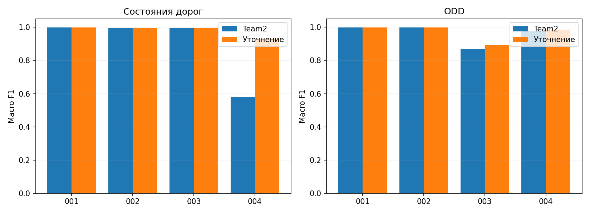

# Уточнение дорожных состояний и ODD

Базовая версия Team2: 6486a44. Новый runtime: 09a34db. Полные TRAIN являются проверкой известных разработчику сценариев, а не независимым прогнозом приватного качества. Формулы ручные, ML отсутствует. Правило CONTINUE/REROUTE не менялось.

Macro F1 усредняется по классам, присутствующим в эталоне данного сценария; ODD измерен для эталонно активных автомобилей. CLOSED в TRAIN отсутствует и проверяется отдельно на синтетике. Оценка статуса источников в JSON — proxy по опубликованным интервалам отказов, а не полный эталон фактической исправности. Сравнения ведутся по тем же входным файлам.

## Измеренные изменения

| Сценарий | Дороги macro F1: Team2 → новая | ODD macro F1: Team2 → новая | Движение вне истинного ODD: Team2 → новая |
|---|---:|---:|---:|
| TRAIN-001 | 0.999386 → 0.999386 | 0.999305 → 0.999305 | 0 → 0 |
| TRAIN-002 | 0.993491 → 0.993491 | 0.999304 → 0.999304 | 0 → 0 |
| TRAIN-003 | 0.995610 → 0.995610 | 0.867278 → 0.890760 | 36 → 4 |
| TRAIN-004 | 0.580002 → 0.927921 | 0.979287 → 0.985429 | 0 → 0 |

### Дорожные классы TRAIN-004

| Класс | F1 Team2 | F1 новая |
|---|---:|---:|
| CONGESTED | 0.689456 | 0.798091 |
| OPEN | 0.988578 | 0.988578 |
| PARTIAL_BLOCK | 0.061972 | 0.997093 |

### Коды ODD

| Сценарий | Код | TP: Team2 → новая | FP | FN |
|---|---|---:|---:|---:|
| TRAIN-003 | MAP_AGE | 0 → 0 | 18 → 18 | 0 → 0 |
| TRAIN-003 | V2X | 1942 → 1942 | 919 → 919 | 0 → 0 |
| TRAIN-003 | VISIBILITY | 0 → 259 | 0 → 35 | 597 → 338 |
| TRAIN-004 | MAP_AGE | 3258 → 3258 | 0 → 0 | 0 → 0 |
| TRAIN-004 | RAIN | 4854 → 4854 | 0 → 255 | 0 → 0 |

## Причины и реализованные исправления

1. **PARTIAL_BLOCK подменялся CONGESTED.** 332 шага истинной частичной блокировки на TRAIN-004 были отнесены к затору. Фильтр сохранял приоритет только для ROAD_OBSERVATION, хотя подтверждение полос приходит также от RSU/цифрового двойника. `corridor/fusion.py` сохраняет приоритет подтверждённого ограничения любого источника. Загрузка остаётся отдельным полем `load`; `corridor/limits.py` использует его для предела 30 км/ч даже при основном PARTIAL_BLOCK и короткой очереди.

2. **Пересекающееся покрытие смешивало разные осадки.** На TRAIN-004 3422 активных шага с истинным COMPLIANT были UNKNOWN; большинство связано с ODD-B и конфликтом rain_level 0/3. Пример: 14:36:05, AV-006 на S006, WX-01 в 10.9 км сообщает 0, WX-02 в 19.1 км сообщает 3, эталон сегмента 0. Новое пространственное допущение для дождя: `w_spatial = w × max(0,1-distance/radius)^2`. Если одна станция имеет >=2/3 пространственного веса, используется её класс дождя и подтверждающие его станции; иначе конфликт сохраняется. Уверенность дополнительно уменьшается на долю пространственной поддержки. Это не точное восстановление микропогоды.

3. **Плохая видимость терялась в конфликте станций.** На TRAIN-003 383 истинных VIOLATED имели UNKNOWN, 49 — COMPLIANT. Большинство этих эпизодов сопровождается DEGRADED и perception_health <0.9. `fusion.py` проверяет три разных свежих последовательных низких измерения станции в покрытии. `odd.py` объединяет их с отдельной бортовой деградацией. AUTO не доказывает соблюдение ODD. Если показания близки к порогу (max(10 м, 0.1 порога)) при деградации, возвращается UNKNOWN; измеренное значение не корректируется и код нарушения не выдумывается. Для будущих сегментов текущая бортовая деградация не считается подтверждением будущей погоды.

## Неустранённые ограничения

- Ошибки V2X нельзя безусловно убрать исключением одного сегмента. На TRAIN-003 863 ложных кодов V2X в ошибочных по статусу ответах почти целиком связаны с S026: обслуживает RSU-04, сообщающий потери 25% и задержки, но labels сегмента v2x_available=1. В 555 таких случаях автомобиль также сообщает REMOTE_REQUESTED и большие потери связи. Надёжного общего правила, позволяющего признать такую связь исправной, из этих полей не следует. ID сегмента в алгоритме не используется как исключение.
- Погодные станции не измеряют условия непосредственно у каждого автомобиля. Пространственная модель дождя и пороги corroboration — вручную выбранные допущения после анализа TRAIN. Они могут иначе работать на PRIVATE.
- Положительное смещение видимости не вычитается автоматически: разные станции могут наблюдать разные условия. Три повторения сами по себе не независимое подтверждение; дополнительным свидетельством является бортовая деградация, также способная ошибаться.
- HOLD вне доказанной зоны остаётся согласованным последним протокольным ответом; улучшение диагностической метрики движения вне ODD не доказывает физическую безопасность.
- Старый архив Team2 и финальный Docker-образ сохранены. Эта доработка отдельно требует контейнерного PUBLIC/PRIVATE-прогона перед новой сдачей.

## Дальнейшие эксперименты

Остались начала и хвосты заторов с очередью меньше 100 м. Пример TRAIN-004 S047 в 14:32:05: очередь около 30 м, фактическая занятость 70%, но дорожного измерителя нет, а рекомендация RSU 65 км/ч не является измеренной скоростью потока. Можно отдельно проверить растущую очередь по трём обновлениям; текущая версия не снижает порог 100 м ради этих labels и не подменяет рекомендуемую скорость фактической.

## Проверки и воспроизводимость

Полных пакетов TRAIN: 2160. Ошибок guard: 0. 68 unittest успешны. SHA runtime проверяется до и после оценки, каждый отчёт связан с Git-коммитом и неизменным SHA входа в EXPERIMENT_LOG.md / docs/experiments.json.

Синтетика: 83 случаев, 3984 ответов; случаев с нарушенным проверенным свойством: 0. Это частичный oracle мутаций, не симулятор физических аварий.

Индикаторы, отличные от нарушений проверяемого свойства: {"SYN-071": {"v2x_mutation_unrecognized": 36, "moving_during_v2x_mutation": 36}, "SYN-073": {"mutated_closure_predicted_available": 60}}. В SYN-071 отдельные решения предшествуют достаточному наблюдаемому подтверждению мутации V2X; в SYN-073 часть оценок доступности предшествует доставке свежего наблюдения закрытия. Причинный алгоритм не читает будущие пакеты и не знает эталон мутации. Эти индикаторы сохранены, а не приравнены к нулевому физическому риску.

| Сценарий | Road MSE: Team2 → новая | ODD MSE: Team2 → новая | Переключения motion |
|---|---:|---:|---:|
| TRAIN-001 | 0.003510 → 0.003510 | 0.122846 → 0.122846 | 132 → 132 |
| TRAIN-002 | 0.015125 → 0.015125 | 0.123308 → 0.123308 | 265 → 265 |
| TRAIN-003 | 0.005531 → 0.005531 | 0.243904 → 0.261838 | 1620 → 1604 |
| TRAIN-004 | 0.019055 → 0.016275 | 0.186471 → 0.169928 | 396 → 396 |

## Цена улучшений и оставшийся риск

TRAIN-004: новая пространственная оценка дождя убрала значительную долю UNKNOWN, но добавила 255 ложных кодов RAIN (раньше 0). TRAIN-003: появилось 259 верных кодов VISIBILITY и 35 ложных; ещё 338 истинных кодов не обнаружены. ODD MSE TRAIN-003 ухудшился с 0.243904 до 0.261838, несмотря на рост macro F1. Confidence остаётся эвристикой, а не откалиброванной вероятностью.

Четыре оставшихся шага движения вне истинного ODD — два автомобиля AV-002/AV-066 на S010 в TRAIN-003, пакеты P0266/P0267 (11:22:10/11:22:15 UTC). Истинная видимость 96.2/91.9 м, применимое сообщение WX-02 — 943.4 м. Борт сообщает DEGRADED и perception_health 0.788–0.807, но нынешнее правило требует также низких или близких к порогу погодных показаний. Поэтому возвращены COMPLIANT и LIMIT_SPEED. Это пробел пространственного покрытия; увеличение числа повторений нормального показания его не исправит.

Следующий отдельный эксперимент безопасности: обрабатывать необъяснённую деградацию восприятия как основание осторожной реакции и запроса поддержки, не выдумывая нарушение VISIBILITY из нормальной погоды. При насыщенном пуле шести операторов требуется допустимая автономная реакция. Такая политика ещё не реализована в этом runtime и требует полного повторного сравнения ложных остановок.

Время TRAIN измерено при параллельном прогоне сценариев; синтетика завершалась с 2/4 рабочими процессами после возобновления с проверкой хешей. Эти измерения не являются контрольным Docker-бенчмарком. Все четыре TRAIN использованы при разработке, независимый hold-out здесь отсутствует.

Журнал версий: [EXPERIMENT_LOG.md](../EXPERIMENT_LOG.md). Полные метрики и хеши: [experiments.json](experiments.json).

## Повтор эксперимента

Из корня checkout: `python tools/evaluate.py --help` описывает полный TRAIN-прогон, `python tools/record_experiment.py --help` — регистрацию всех четырёх отчётов с SHA кода и входов. Runtime следует сохранить неизменным на протяжении всех сценариев. `python tools/replay_suite.py --help` запускает синтетические пакеты; `python tools/check_synthetic_properties.py --synthetic <распакованная_синтетика> --results <каталог_полного_прогона> --out <properties.json>` проверяет отдельные свойства. `tools/refinement_report.py` строит этот отчёт из завершённых результатов. Все эти инструменты офлайн; runtime их не импортирует.

